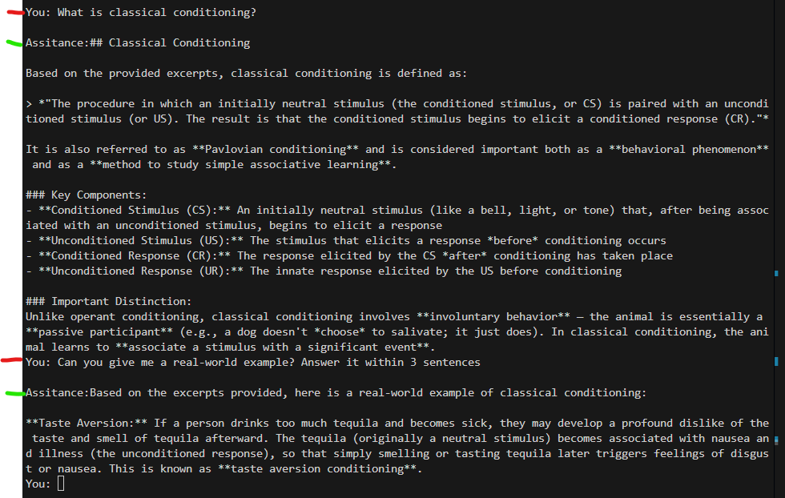

# Psychology RAG Chatbot

A command-line RAG (Retrieval-Augmented Generation) chatbot that lets you ask questions about a psychology textbook and get answers grounded in the actual text — powered by Claude and ChromaDB.

## What it does

- Ingests a PDF textbook and stores it as searchable vector embeddings
- On each question, retrieves the most relevant chunks from the book
- Passes those chunks as context to Claude to generate accurate, grounded answers
- Maintains conversation history so follow-up questions work naturally

## Tech stack

- **[Claude](https://www.anthropic.com/)** — answer generation via the Anthropic API
- **[ChromaDB](https://www.trychroma.com/)** — local vector store for chunk retrieval
- **[sentence-transformers](https://www.sbert.net/)** — local embeddings (all-MiniLM-L6-v2)
- **[pypdf](https://pypdf.readthedocs.io/)** — PDF text extraction

## Project structure

```
psychology-rag/
├── .env                  # API key (not committed)
├── .env.example          # Template for .env
├── requirements.txt
├── data/
│   └── General Psychology.pdf
├── chroma_db/            # Auto-created on first ingest
├── utils.py              # Chunking and embedding helpers
├── ingest.py             # PDF → chunks → embeddings → ChromaDB
└── chat.py               # Question → retrieve → Claude → answer
```

## Setup

**1. Clone the repo and create a virtual environment**

```bash
git clone https://github.com/karthik984/psychology-rag.git
cd psychology-rag
python -m venv .venv

# Windows
.venv\Scripts\Activate.ps1

# Mac/Linux
source .venv/bin/activate
```

**2. Install dependencies**

```bash
pip install -r requirements.txt
```

**3. Add your Anthropic API key**

```bash
cp .env.example .env
# Edit .env and add your key
```

```
ANTHROPIC_API_KEY=sk-ant-yourkey
```

**4. Add your PDF**

Place your PDF inside the data/ folder. Update PDF_PATH in ingest.py if your filename differs.

**5. Ingest the PDF (run once)**

```bash
python ingest.py
```

This extracts text, chunks it, embeds each chunk, and saves everything to ChromaDB on disk. For a 600-page book this takes roughly 2-3 minutes. You only need to run this once.

**6. Start chatting**

```bash
python chat.py
```

## Example

```

```

## How it works

```
Ingest:  PDF → extract text → chunk (600 words, 100 overlap) → embed → ChromaDB
Query:   question → embed → top-5 similar chunks → Claude prompt → answer
```

## Notes

- The chroma_db/ folder is gitignored — each user runs ingest.py locally
- Embeddings use all-MiniLM-L6-v2, a free local model (~90MB, downloaded on first run)
- Type clear to reset conversation history, quit to exit

